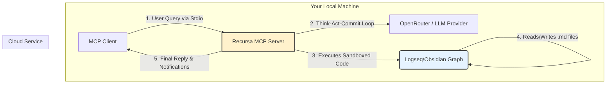

# Recursa MCP: The Git-Native Memory Layer for Local-First LLMs

**[Project Status: Active Development]**

**TL;DR:** Recursa MCP gives your AI a perfect, auditable memory that lives and grows in your local filesystem. It's an open-source Model Context Protocol (MCP) server that uses your **Logseq/Obsidian graph** as a dynamic, version-controlled knowledge base. Your AI's brain becomes a plaintext repository you can `grep`, `edit`, and `commit`.

Forget wrestling with databases or opaque cloud APIs. This is infrastructure-free, plaintext-first memory for agents that _create_.

---

## The Problem: Agent Amnesia & The RAG Ceiling

You're building an intelligent agent and have hit the memory wall. The industry's current solutions are fundamentally flawed, leading to agents that can't truly learn or evolve:

1.  **Vector DBs (RAG):** A read-only librarian. It's excellent for retrieving existing facts but is structurally incapable of _creating new knowledge_, _forming novel connections_, or _evolving its understanding_ based on new interactions.
2.  **Opaque Self-Hosted Engines:** You're lured by "open source" but are now a part-time DevOps engineer, managing Docker containers and databases instead of focusing on intelligence.
3.  **Black-Box APIs:** You trade infrastructure pain for a vendor's prison. Your AI's memory is locked away, inaccessible to your tools, and impossible to truly audit.

Recursa is built on a different philosophy: **Your AI's memory should be a dynamic, transparent, and versionable extension of its own thought process, running entirely on your machine.**

## The Recursa Philosophy: Core Features

Recursa isn't a database; it's a reasoning engine. It treats a local directory of plaintext files—ideally a Git repository—as the agent's primary memory.

- **Git-Native Memory:** Every change is a `git commit`. You get a perfect, auditable history. Branch memory, merge concepts, and revert to previous states.
- **Plaintext Supremacy:** The AI's brain is a folder of markdown files. Compatible with Obsidian and Logseq.
- **Think-Act-Commit Loop:** The agent reasons, generates TypeScript code to modify memory, executes it in a secure sandbox, and commits the result.
- **Safety Checkpoints:** Agents can `mem.saveCheckpoint()` before complex operations and `mem.revertToLastCheckpoint()` if they fail.
- **Token-Aware:** Tools like `mem.getTokenCount()` help the agent manage context limits efficiently.
- **Cross-Platform & Mobile Ready:** Runs on Linux, macOS, Windows, and **Android via Termux**.

## How It Works: Architecture

Recursa is a local, stateless server that acts as a bridge between your MCP client (e.g., Claude Desktop, custom tools), an LLM, and your local knowledge graph.



1.  **Query via MCP:** Client sends a query.
2.  **Think-Act Loop:** Recursa plans using the LLM.
3.  **Generate & Execute:** The LLM generates TypeScript code; Recursa runs it in a Node.js VM sandbox.
4.  **Interact with Files:** The code uses the `mem` API to read/write markdown files.
5.  **Commit & Reply:** The agent commits changes to Git and replies to the user.

## 🚀 Getting Started

### Prerequisites

- [Node.js](https://nodejs.org/) (v20+ recommended)
- A local [Logseq](https://logseq.com/) or [Obsidian](https://obsidian.md/) graph (a folder of `.md` files)
- An [OpenRouter.ai](https://openrouter.ai/) API Key

### 1. Installation

**Option 1: Install via npm (Recommended)**

```bash
npm install -g recursa-mcp
```

**Option 2: Clone and build from source**

```bash
git clone https://github.com/recursa-hq/recursa-doc.git
cd recursa-doc
npm install
```

### 2. Configuration

Create a `.env` file:

```bash
cp .env.example .env
```

Edit `.env`:

```env
# Your OpenRouter API Key
OPENROUTER_API_KEY="sk-or-..."

# The ABSOLUTE path to your graph's directory
KNOWLEDGE_GRAPH_PATH="/path/to/your/notes"

# Optional: Model selection
LLM_MODEL="anthropic/claude-3-haiku-20240307"
```

### 3. Building and Running

**Standard Development:**

```bash
# Build the project
npm run build

# Start the server (Stdio mode)
npm start
```

**For Termux (Android):**

Recursa is optimized for mobile devices running Termux.

```bash
# Install dependencies with Termux compatibility
npm run install:termux

# Build for Termux
npm run build:termux

# Start the server
npm run start:termux
```

### 4. Connecting an MCP Client

Recursa runs as an MCP server over Stdio. Configure your MCP client (like Claude Desktop) to run the startup command:

**For npm-installed version:**

```json
{
  "mcpServers": {
    "recursa": {
      "command": "recursa-mcp",
      "env": {
        "OPENROUTER_API_KEY": "your-key",
        "KNOWLEDGE_GRAPH_PATH": "/absolute/path/to/graph"
      }
    }
  }
}
```

**For source-built version:**

```json
{
  "mcpServers": {
    "recursa": {
      "command": "node",
      "args": ["/path/to/recursa-doc/dist/server.js"],
      "env": {
        "OPENROUTER_API_KEY": "your-key",
        "KNOWLEDGE_GRAPH_PATH": "/absolute/path/to/graph"
      }
    }
  }
}
```

## 🛠️ Implemented Tools

The agent has access to the following capabilities via the `mem` object:

- **File Operations:** `readFile`, `writeFile`, `updateFile` (atomic CAS), `deletePath`, `rename`, `fileExists`, `createDir`, `listFiles`.
- **Git Operations:** `commitChanges`, `gitLog`, `gitDiff`, `getChangedFiles`.
- **Graph Operations:** `queryGraph` (property & link queries), `getBacklinks`, `getOutgoingLinks`, `searchGlobal`.
- **State Management:** `saveCheckpoint`, `revertToLastCheckpoint`, `discardChanges`.
- **Utilities:** `getTokenCount`, `getGraphRoot`.

## 🗺️ Roadmap

- [ ] **Visualizer:** A simple web UI to visualize the agent's actions and the knowledge graph's evolution.
- [ ] **Multi-modal Support:** Storing and referencing images.
- [ ] **Agent-to-Agent Collaboration:** Enabling two Recursa agents to collaborate via Git.

## 📜 License

MIT License.

**Stop building infrastructure. Start building intelligence.**
